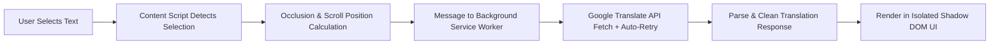

<div align="center">

# 🌐 Quick Web Translator (En → Ru)

**A fast, elegant, and distraction-free standalone browser extension (Manifest V3) for instant English-to-Russian translation on any webpage.**

[](manifest.json)
[](LICENSE)
[](manifest.json)
[]()
[](https://github.com/PheromoneItsMe)

<p align="center">
  <b><a href="#english-version">English</a></b> | <b><a href="#russian-version--русская-версия">Русский</a></b>
</p>

</div>

---

# English Version

> [!NOTE]
> **Standalone Extension (v1.3.0)**: Quick Web Translator is built as a native **Manifest V3 Browser Extension**. It runs directly in Brave, Chrome, Edge, and other Chromium-based browsers without requiring any userscript manager.

## ✨ Features

- ⚡ **Instant Translation**: Highlight or select any English word, phrase, or multi-line paragraph—clean Russian translation appears immediately.
- 🌐 **Full Single Page Application (SPA) Support**: Works seamlessly on dynamic platforms including **YouTube** (video descriptions, live chat, comments), **Google Gemini**, **ChatGPT**, Reddit, dynamic wikis, and complex Web Components.
- 🪟 **Draggable Floating Window**: Grab the header and reposition the translation popup anywhere across your screen without blocking text underneath.
- 📐 **Resizable (Windows-style)**: Resize freely by dragging any edge or the bottom-right corner to view long paragraphs comfortably.
- 🔊 **Audio Pronunciation with Play / Stop**:
  - Click 🔊 to listen to authentic English pronunciation.
  - The icon dynamically shifts to a stop button ⏹️ during playback.
  - Click ⏹️ anytime to halt playback instantly.
  - Click again to restart playback from the beginning.
- 📋 **1-Click Copy**: Fast clipboard copy button with smooth toast notification feedback.
- 🛡️ **Zero Style Leakage (Shadow DOM)**: All styling is completely encapsulated inside an open `ShadowRoot`. Website stylesheets cannot break the popup, and popup styles never pollute the webpage.
- 👁️ **Eye-Friendly Dark Glassmorphic Design**: Modern dark theme with soft contrast typography (`#f1f5f9`), frosted glass blur (`backdrop-filter`), and smooth micro-animations.
- 🖱️ **Effortless Dismissal**: Click anywhere outside the popup or tap <kbd>Escape</kbd> to dismiss.
- ⚙️ **Popup Settings & Dual Modes**:
  - **Auto-Translate**: Instantly displays translation upon text selection.
  - **Button Trigger**: Displays a subtle floating icon near your cursor before opening the popup.

---

## 🛠️ Installation Guide

Installing the extension in Brave, Chrome, or Edge takes less than 15 seconds:

### Step 1: Download or Clone the Repository
```bash
git clone https://github.com/PheromoneItsMe/quick-web-translator.git
```
*(Or download and extract the ZIP archive to your computer)*

### Step 2: Open Extensions in Browser
1. In **Brave**, navigate to `brave://extensions/`  
   *(In Chrome: `chrome://extensions/` | In Edge: `edge://extensions/`)*
2. In the top-right corner, toggle **"Developer mode"** to **ON**.

### Step 3: Load the Extension
1. Click the **"Load unpacked"** button in the top-left corner.
2. Select the repository folder containing `manifest.json`.
3. 🎉 **Done!** The extension is now active and ready on all websites.

---

## 🏗️ Architecture & How It Works



1. **Native Background Service Worker (`background.js`)**: Executes translation requests in the background, bypassing all webpage CORS and Content Security Policy (CSP) restrictions, and implements smart fallback for mixed-language content.
2. **Encapsulated Content Script (`content.js`)**: Injected into web pages, listening for text selections, managing occlusion detection, dynamic real-time positioning, and rendering the Shadow DOM UI.
3. **Settings Management (`popup.html` / `popup.js`)**: Allows toggling trigger modes with settings synced via `chrome.storage`.

---

## 🎮 Controls & Shortcuts

| Action | How to Trigger |
| :--- | :--- |
| **Translate text** | Highlight any English text on any webpage |
| **Move popup** | Click and drag the popup header bar |
| **Resize popup** | Drag the bottom-right corner or edges |
| **Listen / Stop Audio** | Click 🔊 to play, click ⏹️ to stop |
| **Copy translation** | Click the copy icon 📋 in the header |
| **Dismiss popup** | Click anywhere outside the popup or press <kbd>Esc</kbd> |

---

## 🚀 What's New in v1.3.0

- 🧠 **Smart Mixed-Language Translation Auto-Correction**: Fixed an issue where selecting mixed text (such as English headlines accompanied by non-English source citations or metadata) caused the translation engine's auto-detector to misclassify the text and return English words untranslated. The background service worker now automatically detects and re-translates the English content seamlessly.
- 🎯 **Real-Time Scroll & Window Resize Anchoring**: The floating trigger button now dynamically tracks the exact on-screen position of selected text in real time across the page and scrollable containers (`window.scroll`, `overflow: auto/scroll` divs) using `requestAnimationFrame`.
- 🛡️ **Universal Occlusion & Container Clipping Detection**:
  - Automatically detects when selected text scrolls behind fixed/sticky navigation bars, toolbars, or headers (such as YouTube's search bar `#masthead` or Google Gemini's bottom `<input-container>` prompt area) using multi-point DOM hit-testing (`document.elementsFromPoint`).
  - Gracefully hides the trigger button when occluded or clipped by parent container boundaries, preventing visual overlap with website controls.
  - Automatically restores button visibility the instant text scrolls back into visible view.
- 🔄 **Adaptive Trigger Button Placement**: Dynamically checks clearance and automatically flips the trigger button above or below the selection depending on available viewport space and nearby sticky headers.
- ⚡ **Optimized Lifecycle & Selection Cleanup**: Immediate button dismissal upon clearing selections or clicking outside, preventing lingering UI artifacts.

---

# Russian Version / Русская версия

> [!NOTE]
> **Автономное расширение (v1.3.0)**: Quick Web Translator создан как нативное **браузерное расширение (Manifest V3)**. Оно работает напрямую в Brave, Chrome, Edge и других браузерах и **не требует** сторонних менеджеров скриптов (Tampermonkey).

## ✨ Возможности

- ⚡ **Мгновенный перевод**: Выделите любое английское слово, фразу или длинный абзац — перевод на русский появится мгновенно рядом с курсором.
- 🌐 **Полная совместимость с SPA и нейросетями**: Безупречно работает на динамических сайтах, включая **YouTube** (комментарии, описания, чат), **Google Gemini**, **ChatGPT**, Reddit, вики и веб-компоненты.
- 🪟 **Перемещение окна (Drag & Drop)**: Зажмите заголовок окна и перемещайте его в любое удобное место экрана.
- 📐 **Изменение размера (Resize как в Windows)**: Свободно меняйте ширину и высоту окна за границы или правый нижний угол.
- 🔊 **Озвучка с управлением Play / Stop**:
  - Нажмите 🔊 для прослушивания произношения оригинального текста.
  - Во время воспроизведения иконка динамически меняется на значок ⏹️ (**Стоп**).
  - Нажатие на ⏹️ немедленно останавливает звук.
  - Следующее нажатие запускает озвучку заново с начала.
- 📋 **Копирование в 1 клик**: Удобная кнопка копирования перевода в буфер обмена с подтверждающим уведомлением.
- 🛡️ **Полная изоляция стилей (Shadow DOM)**: Интерфейс изолирован внутри `ShadowRoot`. Стили сайтов не могут сломать внешний вид переводчика, а стили переводчика не влияют на страницу.
- 👁️ **Комфортная тёмная тема**: Эффект матового стекла (`backdrop-filter`), мягкая контрастная типографика и субпиксельное сглаживание шрифтов.
- 🖱️ **Быстрое закрытие**: Клик в любое место страницы вне окна или нажатие клавиши <kbd>Esc</kbd>.
- ⚙️ **Всплывающее меню настроек и два режима работы**:
  - **Автоматический перевод**: Показ окна сразу при выделении текста.
  - **Кнопка-триггер**: Появление аккуратной иконки перед открытием основного окна.

---

## 🛠️ Инструкция по установке

Установка расширения в Brave, Chrome или Edge занимает менее 15 секунд:

### Шаг 1: Скачайте или клонируйте репозиторий
```bash
git clone https://github.com/PheromoneItsMe/quick-web-translator.git
```
*(Или скачайте ZIP-архив и распакуйте папку на компьютере)*

### Шаг 2: Откройте управление расширениями
1. В браузере **Brave** вставьте в адресную строку: `brave://extensions/`  
   *(В Chrome: `chrome://extensions/` | В Edge: `edge://extensions/`)*
2. В правом верхнем углу включите переключатель **«Режим разработчика»** (Developer mode).

### Шаг 3: Загрузите расширение
1. В левом верхнем углу нажмите **«Загрузить распакованное»** (Load unpacked).
2. Выберите папку с проектом (где находится файл `manifest.json`).
3. 🎉 **Готово!** Расширение активировано и работает на всех страницах.

---

## 🎮 Горячие клавиши и управление

| Действие | Как выполнить |
| :--- | :--- |
| **Перевести текст** | Выделите любой английский текст мышкой или клавиатурой |
| **Переместить окно** | Зажмите левой кнопкой мыши верхнюю панель окна и перетаскивайте |
| **Изменить размер** | Потяните за нижний правый угол или границы окна |
| **Озвучить / Остановить** | Нажмите 🔊 для старта, нажмите ⏹️ для остановки |
| **Скопировать перевод** | Нажмите иконку копирования 📋 в шапке окна |
| **Закрыть окно** | Кликните в любое место вне окна или нажмите <kbd>Esc</kbd> |

---

## 🚀 Что нового в версии 1.3.0

- 🧠 **Умная автокоррекция смешанного текста**: Исправлен баг, когда при выделении английского текста со сносками, цитатами или примечаниями на другом языке встроенный автоопределитель языка определял весь фрагмент как русский и возвращал английские слова без перевода. Сервисный воркер теперь автоматически распознаёт такие случаи и повторно запрашивает перевод с английского на русский.
- 🎯 **Синхронное отслеживание прокрутки и ресайза (Scroll Tracking)**: Плавающая кнопка-триггер теперь плавно и точно в реальном времени следует за выделенным текстом при скролле страницы или внутренних прокручиваемых блоков (`overflow: auto/scroll`) с использованием `requestAnimationFrame`.
- 🛡️ **Универсальная система защиты от перекрытий (Occlusion & Clipping Detection)**:
  - Автоматически распознает, когда выделенный текст уходит под фиксированные шапки, панели навигации или тулбары (например, поле ввода сообщений в Google Gemini `<input-container>` или верхнюю панель поиска YouTube `#masthead`) с помощью попиксельного hit-тестирования (`document.elementsFromPoint`).
  - Аккуратно скрывает кнопку, если текст перекрыт сторонними панелями или вышел за границы родительского скролл-контейнера, исключая наслоение кнопки на элементы управления сайта.
  - Мгновенно восстанавливает видимость кнопки, как только текст возвращается в видимую область.
- 🔄 **Адаптивное размещение кнопки**: Автоматически проверяет доступное свободное пространство и переворачивает кнопку вверх (`top - 28px`) или вниз (`bottom + 6px`), чтобы она не вылезала за экран и не попадала под верхние фиксированные панели.
- ⚡ **Оптимизация жизненного цикла выделения**: Мгновенное удаление кнопки при снятии выделения или клике в сторону, исключающее появление остаточных элементов интерфейса.

---

## 📄 License

Distributed under the **MIT License**. See [`LICENSE`](LICENSE) for more details.

**Author**: [Pheromone](https://github.com/PheromoneItsMe)
