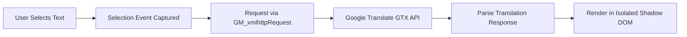

# 🌐 Quick Web Translator (En → Ru)

**A lightweight, sleek, and distraction-free userscript for instant English-to-Russian translation on any webpage.**

  <b><a href="#english-version">English</a></b> | <b><a href="#russian-version--русская-версия">Русский</a></b>

---

# English Version

## ✨ Features

- ⚡ **Instant Translation**: Simply highlight/select any English word, phrase, or paragraph—clean Russian translation pops up immediately.
- 🪟 **Draggable Floating Window**: Grab the header and move the translation popup anywhere across your screen without blocking text underneath.
- 📐 **Resizable (Windows-style)**: Resize freely by dragging any edge or the bottom-right corner to accommodate small words or lengthy multi-paragraph texts.
- 🔊 **Audio Pronunciation with Stop / Play**:
  - Click 🔊 to listen to authentic English pronunciation.
  - The icon dynamically shifts to a stop button ⏹️.
  - Click ⏹️ anytime to instantly halt playback.
  - Click again to restart playback from the beginning.
- 📋 **1-Click Copy**: Fast clipboard copy button with smooth toast feedback.
- 🛡️ **Zero Style Leakage (Shadow DOM)**: All styling is isolated within a `ShadowRoot`. Website stylesheets cannot break the popup, and popup styles never affect the host page.
- 👁️ **Eye-Friendly Dark Theme**: Soft contrast typography (`#f1f5f9`), subpixel text smoothing (`optimizeLegibility`), and gentle frosted-glass blur (`backdrop-filter`).
- 🖱️ **Effortless Dismissal**: Click anywhere outside the popup or tap <kbd>Escape</kbd> to dismiss.
- ⚙️ **Dual Trigger Modes**:
  - **Auto-Translate**: Instantly shows translation upon text selection.
  - **Button Trigger**: Shows a subtle floating icon near your cursor before opening the full popup.

---

## 🚀 Installation

### 1. Install a Userscript Manager
Install [Tampermonkey](https://www.tampermonkey.net/) (or Violentmonkey) from the Chrome Web Store:
- **[Tampermonkey for Brave / Chrome / Edge](https://chromewebstore.google.com/detail/tampermonkey/dhdgffkkebhmkfjojejmpbldmpobfkfo)**

> [!TIP]
> **For Brave Browser Users:**  
> Make sure **Developer Mode** is enabled under `brave://extensions/` (top-right corner).

### 2. Add the Script
1. Open Tampermonkey in your browser and click **"Create a new script..."**.
2. Replace any template code with the full code from **[`userscript.user.js`](userscript.user.js)**.
3. Save the script (<kbd>Ctrl + S</kbd> or **File → Save**).

### 3. Test & Enjoy
1. Open any English website (e.g., [Wikipedia](https://en.wikipedia.org/wiki/Computer_science), [GitHub](https://github.com), or the included [`demo.html`](demo.html)).
2. Select any word or sentence—your translation popup will appear instantly!

---

## 🎮 Usage & Shortcuts

| Action | How to Trigger |
| :--- | :--- |
| **Translate text** | Highlight any English text on any webpage |
| **Move window** | Click and drag the popup header bar |
| **Resize window** | Drag bottom-right corner or edges |
| **Play / Stop Audio** | Click 🔊 to play, click ⏹️ to stop instantly |
| **Copy Translation** | Click the copy icon 📋 in the header |
| **Dismiss Window** | Click outside the window or press <kbd>Esc</kbd> |
| **Switch Trigger Mode** | Click the gear icon ⚙️ in the header |

---

## 🔬 Architecture

1. **Text Detection**: Listens to non-invasive `mouseup` and selection change events.
2. **CORS Bypass**: Utilizes `GM_xmlhttpRequest` to perform secure, direct API calls without browser CORS or CSP restrictions.
3. **Encapsulation**: Creates a single `#qwt-translator-host` with an open `ShadowRoot`, ensuring zero CSS conflicts with any webpage.

---

# Russian Version / Русская версия

## ✨ Возможности

- ⚡ **Мгновенный перевод**: Выделите английское слово, фразу или абзац — русский перевод появится сразу.
- 🪟 **Перемещение окна (Drag & Drop)**: Зажмите верхнюю шапку окна и перетаскивайте его в любое удобное место экрана.
- 📐 **Изменение размера (Resize как в Windows)**: Потяните за правый нижний угол или любую сторону окна для изменения ширины и высоты.
- 🔊 **Управление озвучкой (Play / Stop)**: 
  - Нажмите 🔊 для прослушивания произношения оригинального текста.
  - Иконка динамически меняется на значок ⏹️ (**Стоп**).
  - Нажатие на ⏹️ немедленно останавливает воспроизведение.
  - Следующее нажатие запускает озвучку заново с начала.
- 📋 **Копирование в 1 клик**: Удобная кнопка копирования перевода в буфер обмена.
- 🛡️ **Изоляция Shadow DOM**: Окно полностью изолировано от стилей сайта.
- 👁️ **Приятный для глаз интерфейс**: Мягкая типографика, эффект матового стекла и антиалиасинг для комфортного чтения.
- 🖱️ **Быстрое закрытие**: Клик в любое место страницы вне окна или клавиша <kbd>Esc</kbd>.

---

## 🚀 Установка

### 1. Установка расширения
Установите [Tampermonkey](https://chromewebstore.google.com/detail/tampermonkey/dhdgffkkebhmkfjojejmpbldmpobfkfo) для вашего браузера (Brave, Chrome, Edge, Firefox).

> [!TIP]
> **Для пользователей Brave:**  
> Откройте `brave://extensions/` и включите переключатель **«Developer mode»** (Режим разработчика) в правом верхнем углу.

### 2. Добавление скрипта
1. Нажмите на иконку Tampermonkey в браузере → **«Создать новый скрипт...»**.
2. Вставьте весь код из файла **[`userscript.user.js`](userscript.user.js)**.
3. Сохраните скрипт (<kbd>Ctrl + S</kbd>).

### 3. Проверка
Откройте любой англоязычный сайт или файл [`demo.html`](demo.html) и выделите текст.

---

## 🎮 Горячие клавиши и управление

| Действие | Как выполнить |
| :--- | :--- |
| **Перевести текст** | Выделите любой английский текст на странице |
| **Переместить окно** | Зажмите левой кнопкой мыши верхнюю панель окна (шапку) и тяните |
| **Изменить размер** | Потяните за нижний правый угол или границы окна |
| **Озвучить / Стоп** | Нажмите 🔊 для старта, нажмите ⏹️ для остановки |
| **Скопировать перевод** | Нажмите иконку копирования 📋 в шапке окна |
| **Закрыть окно** | Кликните вне окна или нажмите <kbd>Esc</kbd> |

---

## 📄 License

Distributed under the **MIT License**. See [`LICENSE`](LICENSE) for more information.

Author: **[Pheromone](https://github.com/PheromoneItsMe)**
