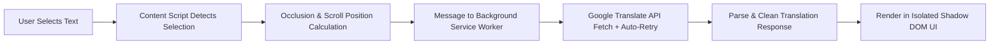

<div align="center">

# 🌐 Quick Web Translator (En → Ru)

**A fast, elegant, and distraction-free standalone browser extension (Manifest V3) for instant English-to-Russian translation on any webpage.**

[](manifest.json)
[](LICENSE)
[](manifest.json)
[]()
[](https://github.com/PheromoneItsMe)

<p align="center">
  <b><a href="#english-version">English</a></b> | <b><a href="#russian-version--русская-версия">Русский</a></b>
</p>

</div>

---

# English Version

> [!NOTE]
> **Standalone Extension (v1.4.1)**: Quick Web Translator is built as a native **Manifest V3 Browser Extension**. It runs directly in Brave, Chrome, Edge, and other Chromium-based browsers without requiring any userscript manager.

## ✨ Features

- ⚡ **Instant Translation**: Highlight or select any English word, phrase, or multi-line paragraph—clean Russian translation appears immediately.
- 🌐 **Full Single Page Application (SPA) Support**: Works seamlessly on dynamic platforms including **YouTube** (video descriptions, live chat, comments), **Google Gemini**, Reddit, dynamic wikis, and complex Web Components.
- 📌 **Pin Window in Place**: Lock the translation window in a fixed position anywhere on screen. As you read and select new text, the window stays stationary while dynamically updating the translation in real time.
- 🪟 **Draggable Floating Window**: Grab the header and reposition the translation popup anywhere across your screen without blocking text underneath.
- 📐 **8-Directional Window Resizing (Windows-style)**: Freely resize the window from all 8 directions—pull any of the 4 borders (top, bottom, left, right) or any of the 4 corners.
- 🔊 **Audio Pronunciation with Play / Stop**:
  - Click 🔊 to listen to authentic English pronunciation.
  - The icon dynamically shifts to a stop button ⏹️ during playback.
  - Click ⏹️ anytime to halt playback instantly.
  - Click again to restart playback from the beginning.
- 📋 **1-Click Copy**: Fast clipboard copy button with smooth toast notification feedback.
- 👁️ **Eye-Friendly Dark Glassmorphic Design**: Modern dark theme with soft contrast typography (`#f1f5f9`), frosted glass blur (`backdrop-filter`), and smooth micro-animations.
- 🖱️ **Effortless Dismissal**: Click anywhere outside the popup or tap <kbd>Escape</kbd> to dismiss.
- ⚙️ **Popup Settings & Dual Modes**:
  - **Auto-Translate**: Instantly displays translation upon text selection.
  - **Button Trigger**: Displays a subtle floating icon near your cursor before opening the popup.

---

## 🛠️ Installation Guide

Installing the extension in Brave, Chrome, or Edge takes less than 15 seconds:

### Step 1: Download or Clone the Repository
```bash
git clone https://github.com/PheromoneItsMe/quick-web-translator.git
```
*(Or download and extract the ZIP archive to your computer)*

### Step 2: Open Extensions in Browser
1. In **Brave**, navigate to `brave://extensions/`  
   *(In Chrome: `chrome://extensions/` | In Edge: `edge://extensions/`)*
2. In the top-right corner, toggle **"Developer mode"** to **ON**.

### Step 3: Load the Extension
1. Click the **"Load unpacked"** button in the top-left corner.
2. Select the repository folder containing `manifest.json`.
3. 🎉 **Done!** The extension is now active and ready on all websites.

---

## 🏗️ Architecture & How It Works



1. **Native Background Service Worker (`background.js`)**: Executes translation requests in the background, bypassing all webpage CORS and Content Security Policy (CSP) restrictions, and implements smart fallback for mixed-language content.
2. **Encapsulated Content Script (`content.js`)**: Injected into web pages, listening for text selections, managing occlusion detection, dynamic real-time positioning, and rendering the Shadow DOM UI.
3. **Settings Management (`popup.html` / `popup.js`)**: Allows toggling trigger modes with settings synced via `chrome.storage`.

---

## 🎮 Controls & Shortcuts

| Action | How to Trigger |
| :--- | :--- |
| **Translate text** | Highlight any English text on any webpage |
| **Pin / Unpin window** | Click the pin icon 📌 in the header bar |
| **Move popup** | Click and drag the popup header bar |
| **Resize popup** | Drag any of the 4 borders or 4 corners (8 directions) |
| **Listen / Stop Audio** | Click 🔊 to play, click ⏹️ to stop |
| **Copy translation** | Click the copy icon 📋 in the header |
| **Dismiss popup** | Click anywhere outside the popup or press <kbd>Esc</kbd> |

---

## 🚀 What's New in v1.4.1

- 🛡️ **Fixed Trigger Button Visibility & Occlusion Bug**: Fixed an issue where selecting text of varying lengths (e.g. adding or removing a single word) or highlighting specific elements like YouTube video titles and multi-line transcripts caused the floating trigger button to intermittently disappear. The occlusion engine now accurately distinguishes true fixed/sticky navigation overlays from normal page elements, and anchors trigger positioning directly to the end of multi-line selections.

---

# Russian Version / Русская версия

> [!NOTE]
> **Автономное расширение (v1.4.1)**: Quick Web Translator создан как нативное **браузерное расширение (Manifest V3)**. Оно работает напрямую в Brave, Chrome, Edge и других браузерах и **не требует** сторонних менеджеров скриптов (Tampermonkey).

## ✨ Возможности

- ⚡ **Мгновенный перевод**: Выделите любое английское слово, фразу или длинный абзац — перевод на русский появится мгновенно рядом с курсором.
- 🌐 **Полная совместимость с SPA**: Безупречно работает на динамических сайтах, включая **YouTube** (комментарии, описания, чат), **Google Gemini**, Reddit, вики и веб-компоненты.
- 📌 **Закрепление окна (Pin Window)**: Зафиксируйте окно переводчика в удобном месте экрана. При дальнейшем чтении и выделении любого текста окно остаётся неподвижным, а перевод динамически обновляется внутри него в реальном времени.
- 🪟 **Перемещение окна (Drag & Drop)**: Зажмите заголовок окна и перемещайте его в любое удобное место экрана.
- 📐 **Изменение размера во всех 8 направлениях (как в Windows)**: Свободно меняйте ширину и высоту окна, потянув за любую из 4 границ (верх, низ, лево, право) или любой из 4 углов.
- 🔊 **Озвучка с управлением Play / Stop**:
  - Нажмите 🔊 для прослушивания произношения оригинального текста.
  - Во время воспроизведения иконка динамически меняется на значок ⏹️ (**Стоп**).
  - Нажатие на ⏹️ немедленно останавливает звук.
  - Следующее нажатие запускает озвучку заново с начала.
- 📋 **Копирование в 1 клик**: Удобная кнопка копирования перевода в буфер обмена с подтверждающим уведомлением.
- 👁️ **Комфортная тёмная тема**: Эффект матового стекла (`backdrop-filter`), мягкая контрастная типографика и субпиксельное сглаживание шрифтов.
- 🖱️ **Быстрое закрытие**: Клик в любое место страницы вне окна или нажатие клавиши <kbd>Esc</kbd>.
- ⚙️ **Всплывающее меню настроек и два режима работы**:
  - **Автоматический перевод**: Показ окна сразу при выделении текста.
  - **Кнопка-триггер**: Появление аккуратной иконки перед открытием основного окна.

---

## 🛠️ Инструкция по установке

Установка расширения в Brave, Chrome или Edge занимает менее 15 секунд:

### Шаг 1: Скачайте или клонируйте репозиторий
```bash
git clone https://github.com/PheromoneItsMe/quick-web-translator.git
```
*(Или скачайте ZIP-архив и распакуйте папку на компьютере)*

### Шаг 2: Откройте управление расширениями
1. В браузере **Brave** вставьте в адресную строку: `brave://extensions/`  
   *(В Chrome: `chrome://extensions/` | В Edge: `edge://extensions/`)*
2. В правом верхнем углу включите переключатель **«Режим разработчика»** (Developer mode).

### Шаг 3: Загрузите расширение
1. В левом верхнем углу нажмите **«Загрузить распакованное»** (Load unpacked).
2. Выберите папку с проектом (где находится файл `manifest.json`).
3. 🎉 **Готово!** Расширение активировано и работает на всех страницах.

---

## 🎮 Горячие клавиши и управление

| Действие | Как выполнить |
| :--- | :--- |
| **Перевести текст** | Выделите любой английский текст мышкой или клавиатурой |
| **Закрепить / Открепить** | Нажмите иконку 📌 в шапке окна |
| **Переместить окно** | Зажмите левой кнопкой мыши верхнюю панель окна и перетаскивайте |
| **Изменить размер** | Потяните за любую из 4 границ или 4 углов (8 направлений) |
| **Озвучить / Остановить** | Нажмите 🔊 для старта, нажмите ⏹️ для остановки |
| **Скопировать перевод** | Нажмите иконку копирования 📋 в шапке окна |
| **Закрыть окно** | Кликните в любое место вне окна или нажмите <kbd>Esc</kbd> |

---

## 🚀 Что нового в версии 1.4.1

- 🛡️ **Исправлен баг скрытия кнопки-триггера при выделении**: Устранена ошибка, из-за которой при изменении длины выделенного текста (даже на одно слово) или выделении определённых блоков (например, заголовков видео на YouTube и строк транскрипта) плавающая кнопка перевода могла внезапно исчезать. Система проверки перекрытий теперь точно распознаёт настоящие фиксированные шапки и модальные окна, не конфликтуя с соседними элементами страницы, а кнопка корректно привязывается к концу многострочного выделения.

---

## 📄 License

Distributed under the **MIT License**. See [`LICENSE`](LICENSE) for more details.

**Author**: [Pheromone](https://github.com/PheromoneItsMe)
